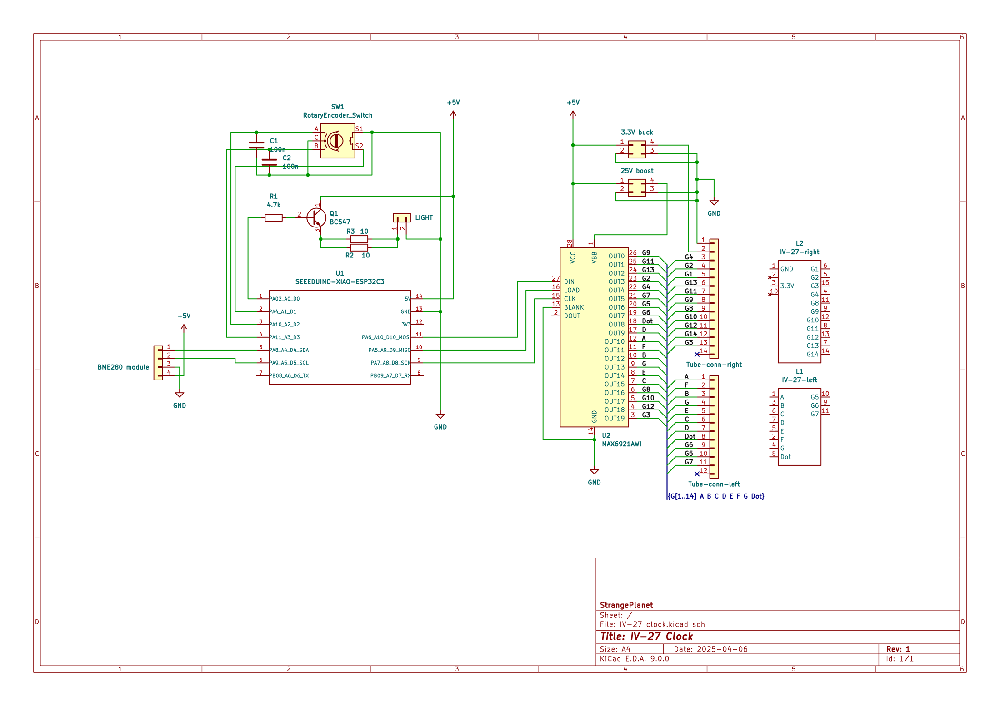

# IV-27 VFD Clock


[More photos on my website](https://photos.strangeplanet.fr/index.php?/category/256-iv_27_vfd_clock)


## Features

- Current time/date (NTP or RTC)
- Temperature + Humidity
- Select displayed info with a rotary knob
- Display simple messages from Home Assistant
- Auto off during night + occupancy sensor from Home Assistant
- Light effects


## Operation

The IV-27 tube is a multiplexed display: it has 8 inputs for each part of a digit (7 segments + dot) and 14 grids to select which digit to display. Thats 22 pins to drive at 25 volts.

For this job we use the MAX6921 IC which has 20 high-voltage outputs (I choose to not use the first grid which only has symbols nor the right-most digit).
The MAX6921 is a simple serial to parallel converter: to send a data frame we have to put `DIN` low or high, ticking `CLK` for each value, once the 20 bits are send, ticking `LOAD` sets the outputs accordingly.

Because the display is multiplexed we have to repetitively set each digit in an infinite loop.


## Bill of materials

- IV-27 VFD tube
- MAX6921 serial-interface
- SOP28 to DIP28 adapter
- Seeed Studio Xiao ESP32C3 MCU
- (optional) BME280 ambient sensor
- (optional) DS3231 RTC
- MT3608 or XL6009 boost converter (25V)
- Mini560 or LM2596 buck converter (3.3V)
- 2x 130mm LED "noodle"
	- NPN transitor and resistors (to drive the lights)
- rotary encoder with push action
	- 2x 100nF capacitors (between GND and the encoder A and B pins)


## Schematics




## Interactions

In display mode:
- single click: toggle on-off
- rotate left or right: switch between time/date/temperature/message
- long click: enter menu

In menu mode:
- rotate left or right: select menu item
- single click: select menu item

In setting:
- rotate left or right: change value
- single click: next element/save
- long click: previous element

Menu content :
- SET DATE (RTC mode only)
- SET TIME (RTC mode only)
- DATE FORMAT: switch between `YYYY-MM-DD` and `DD month` date format
- SET LIGHT: configure lights effect and brightness
- SET DAYTIME: configure start & end time for auto off feature
- TEMP OFFSET: configure the offset of the measured temperature
- MESS TIMEOUT: configure the delay after which the message is displayed
- BACK

## Configuration

### Home Assistant

Add a custom binary sensor with the following attributes:
- `at_home: "{{ states('zone.home') | int(default=0) > 0 }}"`
- `message`: the message to display (only letters, numbers, `.` and `-` symbols)

**Example (extracting next due item from a todo list):**
```yaml
template:
  - triggers:
      - trigger: state
        entity_id:
          - todo.my_list
          - zone.home
        # scheduler to handle item status change
      - trigger: time_pattern
        minutes: "/5"
    action:
      - service: todo.get_items
        data:
          status: needs_action
        target:
          entity_id: todo.my_list
        response_variable: items
    binary_sensor:
      - unique_id: data_for_iv27_clock
        state: true
        attributes:
          at_home: "{{ states('zone.home') | int(default=0) > 0 }}"
          message: >
            
            {{ items['todo.my_list']['items'] 
              | selectattr('due', 'defined') | selectattr('due', 'lt', tdate) 
              | map(attribute='summary') | first() | truncate(255) }}
```

### Firmware

Copy `secrets.tpl.h` into `secrets.h` and fill the values.

- `HA_TOKEN`: go to your HA profile page, then Security, and create a new Long lived token at the bottom of the page (keep the `Bearer ` prefix)
- `HA_URL`: fill in your HA hostname
- `HA_SENSOR`: set the id of the sensor created above
- `OTA_PASS`: choose a password to secure the Wifi OTA update

Copy `upload_params.tpl.ini` into `upload_params.ini` and fill the OTA password.

----

In `constants.hpp` you can also configure:

- `USE_NTP`: use Network Time Prototal, comment to use RTC instead
- `USE_WIFI_OTA`: comment to disable the Wifi OTA
- `USE_TEMP_SENSOR`: comment to disable the ambient sensor
- `USE_HA_MESSAGE`: comment to disable the message display from HA
- `USE_HA_OCCUPANCY`: comment to disable occupancy info from HA
- `TIMEZONE`: timezone for NTP ([check available TZ](https://github.com/esp8266/Arduino/blob/master/cores/esp8266/TZ.h))
- `DRIVER_DIN`, `DRIVER_CLK`, `DRIVER_LOAD`: MCU pins to the MAX6921
- `ENCODER_A`, `ENCODER_B`, `ENCODER_SW`: MCU pins to the rotary encoder
- `LIGHT_P`: MCU pins to the lights
- `GRID`, `SEGMENTS`: MAX6921 pins to the display


## Resources

- https://www.instructables.com/VFD-Alarm-Clock/
- https://www.barbouri.com/2020/07/04/iv-27-icetube-clock-project/


## License

Creative Commons 3.0 BY-SA
